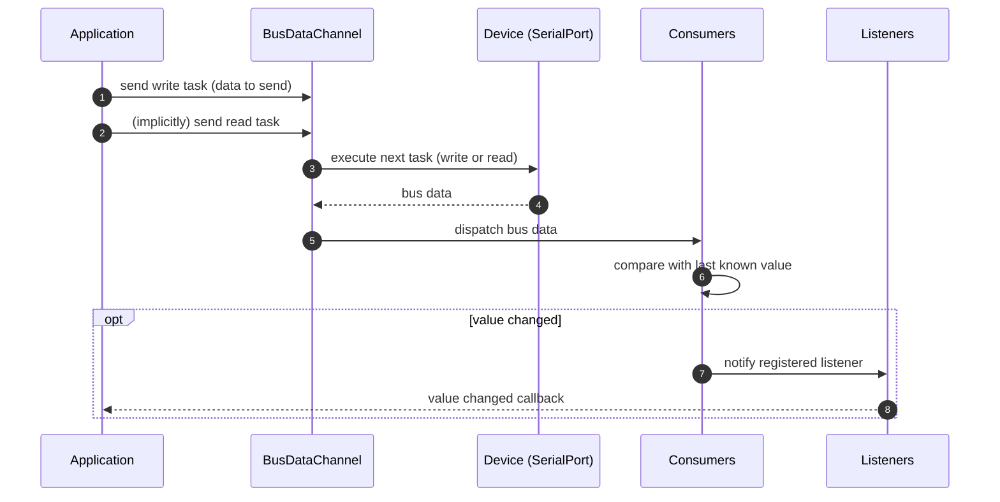
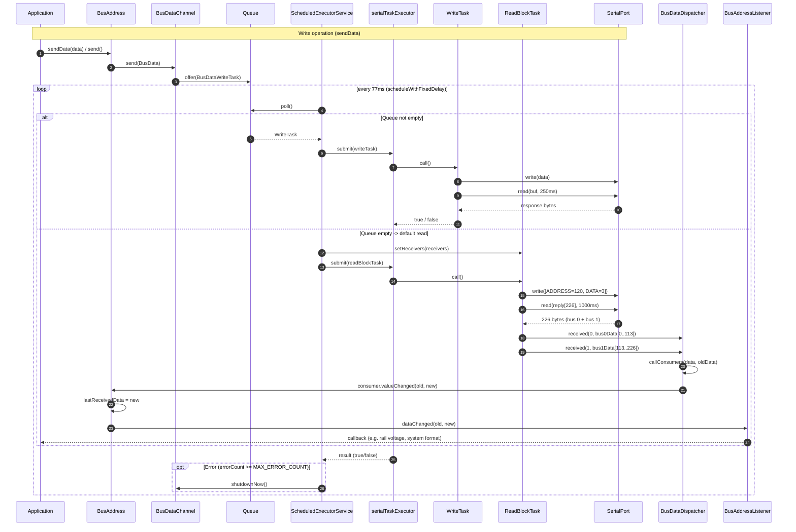

# Sequence Diagram: Reading and Writing the Bus (SerialDevice)

## Simplified Overview

Callers never talk to the serial port directly — they only ever send a task
(write or read) to the `BusDataChannel`. The channel executes tasks against
the device one at a time. Incoming data is handed to the consumers, and only
the consumers whose address actually changed delegate that change to their
registered listeners.

**Summary:**
- The application only ever sends **tasks** (write or read) — it never accesses the serial port itself.
- The `BusDataChannel` executes one task at a time and forwards the resulting bus data to the consumers.
- Consumers track the last known value per address and only delegate to their registered listeners when the value actually **changed**.

## Detailed View

The `BusDataChannel` uses a `ScheduledExecutorService` (delay: 77ms) to control
access to the `SerialPort`. If a write task is queued, it is executed. If the
queue is empty, the `ReadBlockTask` is executed instead, which reads the
complete bus 0 and bus 1 data.

**Summary:**
- **Write**: `BusAddress.sendData()` queues a `BusDataWriteTask` on the `BusDataChannel`. The scheduler picks it up on the next tick, writes the bytes to the `SerialPort`, and reads the acknowledgement (250ms timeout).
- **Read**: If the queue is empty, the scheduler runs the `ReadBlockTask` instead — it sends the request `[120, 3]`, reads 226 bytes (bus 0 + bus 1), and distributes them via `BusDataDispatcher` to all `AbstractBusDataConsumer`s, which in turn update the `BusAddress` objects and notify their `BusAddressListener`s.
- On too many errors (`MAX_ERROR_COUNT`), the channel is terminated via `shutdownNow()`.
